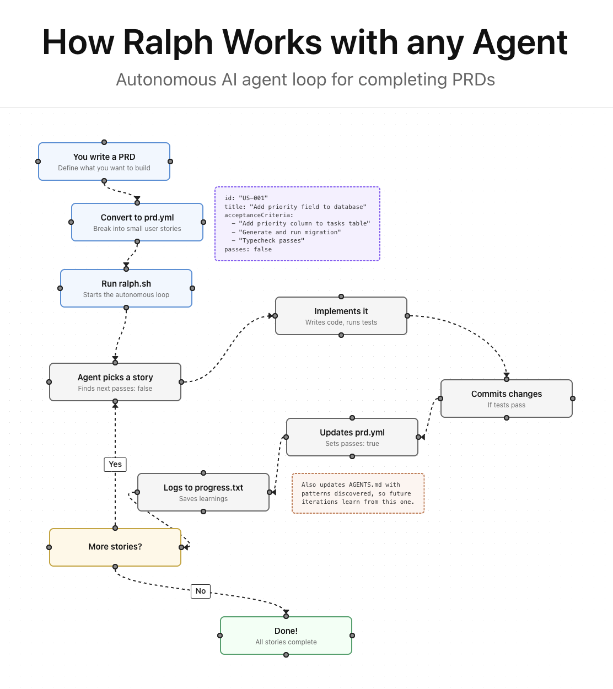

# Ralph


Ralph is an autonomous AI agent loop that runs Cursor CLI repeatedly until all PRD items are complete. Each iteration is a fresh worker invocation with clean context. Memory persists via git history, `scripts/ralph/progress.txt`, and `scripts/ralph/prd.yml`.

Based on [Geoffrey Huntley's Ralph pattern](https://ghuntley.com/ralph/).

[Read my in-depth article on how I use Ralph](https://x.com/ryancarson/status/2008548371712135632)

## Prerequisites

- Cursor CLI (`cursor-agent` or `agent` command) installed and authenticated
- Python 3 installed
- `yq` installed (`brew install yq` on macOS) or Python 3 with PyYAML (`pip install pyyaml`) - optional but recommended
- A git repository for your project

## Installation

### Install Ralph CLI

Install the Ralph CLI globally:

```bash
# From the ralph-cursor repository root
./install.sh
```

This installs the `ralph` command to `~/.local/bin` (or `/usr/local/bin` if that's not writable). Make sure this directory is in your PATH.

### Initialize Ralph in your project

Navigate to your project directory and initialize Ralph:

```bash
# Basic initialization
ralph init

# With Cursor rules and CLI config templates
ralph init --cursor-rules --cursor-cli

# Overwrite existing files
ralph init --force
```

This copies the necessary Ralph files into your project's `scripts/ralph/` directory.


## Workflow

### 1. Create a PRD

Generate a PRD using Cursor in the IDE with the repo's Cursor rules (see `.cursor/rules/`), or create one manually.

### 2. Convert PRD to Ralph format

Convert PRD markdown to `scripts/ralph/prd.yml` using the Cursor helper script:

```bash
./scripts/ralph/cursor/convert-to-prd-yml.sh tasks/prd-[feature-name].md
```

This creates `scripts/ralph/prd.yml` with user stories structured for autonomous execution.

### 3. Run Ralph

Use the Ralph CLI to run the agent loop:

```bash
# Run with default settings (10 iterations)
ralph run

# Run with custom iteration count
ralph run 20

# Run with timeout and model selection
ralph run 10 --cursor-timeout 3600 --model claude-3.5-sonnet
```

You can also run the Python script directly:

```bash
python3 scripts/ralph/ralph.py [max_iterations] [--cursor-timeout SECONDS] [--model MODEL]
```

**Environment Variables:**
- `RALPH_CURSOR_TIMEOUT` - Default timeout in seconds (default: 1800)
- `RALPH_MODEL` - Default model to use (default: 'auto')

The runner loop will invoke Cursor CLI repeatedly. The worker prompt instructs it to:
- Read `scripts/ralph/prd.yml` and `scripts/ralph/progress.txt`
- Implement one story per iteration, run checks, commit, and update `passes: true`
- Stop by outputting `<promise>COMPLETE</promise>` when all stories pass

**Note:** `--cursor-timeout` only applies if a `timeout` binary is available on your PATH. If it isn't, Ralph will use Python's timeout mechanism.

## Key Files

| File | Purpose |
|------|---------|
| `bin/ralph.py` | The Ralph CLI tool (`ralph init` and `ralph run` commands) |
| `scripts/ralph/ralph.py` | The Python loop that spawns fresh Cursor invocations |
| `scripts/ralph/cursor/prompt.cursor.md` | Instructions given to each Cursor iteration |
| `scripts/ralph/cursor/convert-to-prd-yml.sh` | Convert PRD markdown → `scripts/ralph/prd.yml` via Cursor CLI |
| `scripts/ralph/prd.yml` | User stories with `passes` status (the task list) |
| `scripts/ralph/prd.yml.example` | Example PRD format for reference |
| `scripts/ralph/progress.txt` | Append-only learnings for future iterations |
| `flowchart/` | Interactive visualization of how Ralph works |

## Flowchart

[](https://snarktank.github.io/ralph/)

**[View Interactive Flowchart](https://snarktank.github.io/ralph/)** - Click through to see each step with animations.

The `flowchart/` directory contains the source code. To run locally:

```bash
cd flowchart
npm install
npm run dev
```

## Critical Concepts

### Each Iteration = Fresh Context

Each iteration spawns a **new Cursor invocation** with clean context. The only memory between iterations is:
- Git history (commits from previous iterations)
- `scripts/ralph/progress.txt` (learnings and context)
- `scripts/ralph/prd.yml` (which stories are done)

### Small Tasks

Each PRD item should be small enough to complete in one context window. If a task is too big, the LLM runs out of context before finishing and produces poor code.

Right-sized stories:
- Add a database column and migration
- Add a UI component to an existing page
- Update a server action with new logic
- Add a filter dropdown to a list

Too big (split these):
- "Build the entire dashboard"
- "Add authentication"
- "Refactor the API"

### AGENTS.md Updates Are Critical

After each iteration, Ralph updates the relevant `AGENTS.md` files with learnings. This helps future iterations (and future human developers) benefit from discovered patterns, gotchas, and conventions.

Examples of what to add to AGENTS.md:
- Patterns discovered ("this codebase uses X for Y")
- Gotchas ("do not forget to update Z when changing W")
- Useful context ("the settings panel is in component X")

### Feedback Loops

Ralph only works if there are feedback loops:
- Typecheck catches type errors
- Tests verify behavior
- CI must stay green (broken code compounds across iterations)

### Browser Verification for UI Stories

Frontend stories must include "Verify in browser using browser MCP tools" in acceptance criteria. Ralph will use browser MCP tools (if configured) to navigate to the page, interact with the UI, and confirm changes work.

### Stop Condition

When all stories have `passes: true`, Ralph outputs `<promise>COMPLETE</promise>` and the loop exits.

## Debugging

Check current state:

```bash
# See which stories are done
cat scripts/ralph/prd.yml | yq '.userStories[] | {id, title, passes}'
# Or with Python:
python3 -c "import yaml; print('\n'.join([f\"{s['id']}: {s['title']} - passes: {s['passes']}\" for s in yaml.safe_load(open('scripts/ralph/prd.yml'))['userStories']]))"

# See learnings from previous iterations
cat scripts/ralph/progress.txt

# Check git history
git log --oneline -10
```

## Customizing prompts

Edit the worker prompt to customize Ralph's behavior for your project:
- Add project-specific quality check commands
- Include codebase conventions
- Add common gotchas for your stack

Worker prompt location:
- `scripts/ralph/cursor/prompt.cursor.md`

## CLI Commands

### `ralph init`

Initialize Ralph in your current repository:

```bash
ralph init [--force] [--cursor-rules] [--cursor-cli]
```

Options:
- `--force` - Overwrite existing files
- `--cursor-rules` - Also install `.cursor/rules/ralph-prd.mdc`
- `--cursor-cli` - Also install `.cursor/cli.json` template

### `ralph run`

Run the Ralph agent loop:

```bash
ralph run [max_iterations] [--cursor-timeout SECONDS] [--model MODEL]
```

Arguments:
- `max_iterations` - Maximum number of iterations (default: 10)

Options:
- `--cursor-timeout SECONDS` - Timeout for cursor worker in seconds (default: 1800, from `RALPH_CURSOR_TIMEOUT` env)
- `--model MODEL` - Model to use for cursor worker (default: 'auto', from `RALPH_MODEL` env)

## Archiving

Ralph automatically archives previous runs when you start a new feature (different `branchName`). Archives are saved to `scripts/ralph/archive/YYYY-MM-DD-feature-name/`.

## References

- [Geoffrey Huntley's Ralph article](https://ghuntley.com/ralph/)
